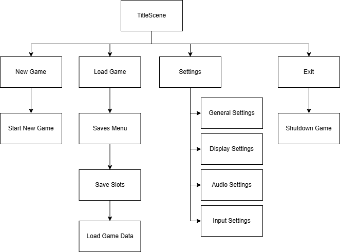
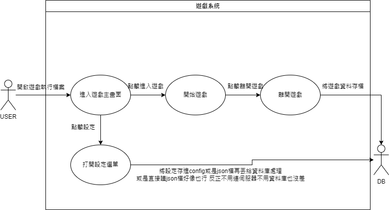
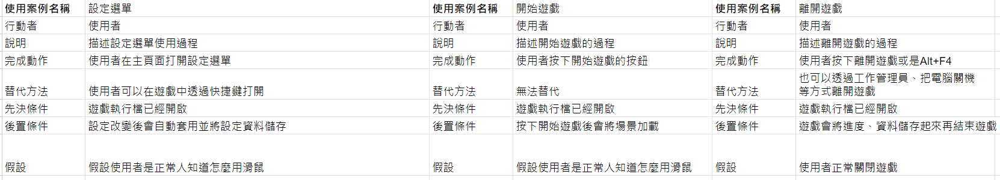

# 第12組 C111118121柳健棠

```
功能性需求:

1.簡潔易懂的使用者介面

  - 遊戲應該提供使用者簡潔易懂的介面
  - 使用者可以一看就知道自己的角色狀態

2.Inventory(庫存?)

  - Inventory裡每個欄位應該要能互相交換
  - 當鼠標移到欄位上面可以彈出該欄位物品的詳細資料
  - 可以自動整理Inventory
  - 將道具移到Inventory外可以丟棄

3.自定義設定

  - 遊戲必須允許使用者自定義遊戲設置
  - 使用者可以更改畫面幀數限制、遊戲音量
  - 系統應自動計算購物車中商品的總價

非功能性需求:

1.性能

  - 遊戲加載場景時的速度要夠快
  - 透過VisibleOnScreenEnabler節點處理地圖上的角色，當角色不在螢幕可見範圍內隱藏以減少性能消耗

2.使用者介面交互性

  - 使用者可以透過滾輪來移動當前在hotbar上選擇的物品
  - 使用者可以透過快捷鍵來開啟選單:Esc開啟設定、B鍵開啟背包...

3.易用性

  - 系統不應該設計得太複雜
  - 使用者可以一看就知道如何操作
```
## 功能分解圖


## 使用案例圖


## 使用案例說明

