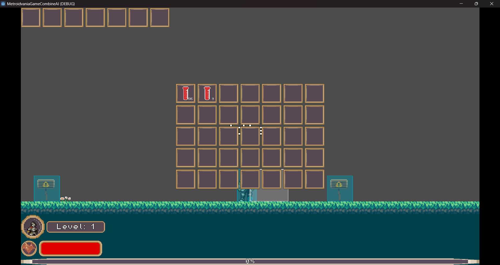

# 第十二組 C111118121柳健棠

分鏡板:

說明：

1.Inventory提供使用者存放物品道具，可以將道具拖移交換，拖移到Inventory之外可以丟棄，右鍵點擊物品可以分割物品

2.Hotbar使用滑鼠滾輪可以切換當前focus，按下使用道具鍵可以快速使用當前focus的物品，或是使用數字鍵快捷使用(如果是可使用的道具)。

3.PlayerStats提供使用者檢查角色數據，可以檢查當前等級、經驗等狀態，並可以使用Ability Point升級能力，長按+按鈕可以持續並加快增加能力，反之-按鈕則減少。

4.PlayerStats按下確認按鈕確認強化，按下重置按鈕可以重新分配點數，非重置全部點數，重置回提升能力前。
